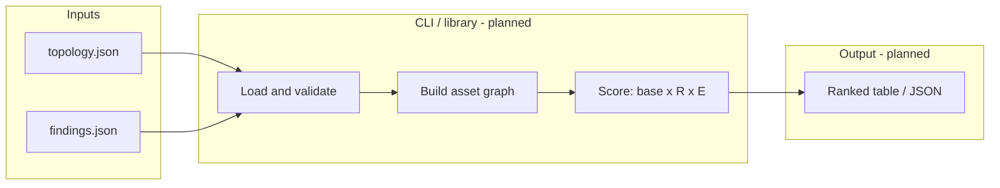

# Architecture diagram

Current foundation is docs-only. The Mermaid diagram below is the **intended** CLI shape; boxes marked *(planned)* are not yet in the tree.

When the package ships, update this diagram so every box maps to a real module path.
