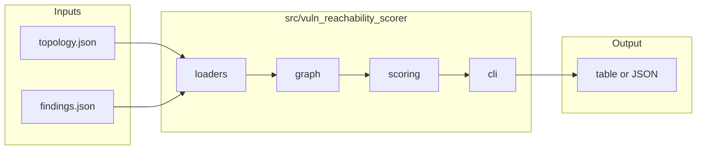

# Architecture diagram

```mermaid
flowchart LR
  subgraph inputs [Inputs]
    T[topology.json]
    F[findings.json]
  end

  subgraph core [src/vuln_reachability_scorer]
    L[loaders]
    G[graph]
    S[scoring]
    C[cli]
  end

  subgraph out [Output]
    R[table or JSON]
  end

  T --> L
  F --> L
  L --> G
  G --> S
  S --> C
  C --> R
```
